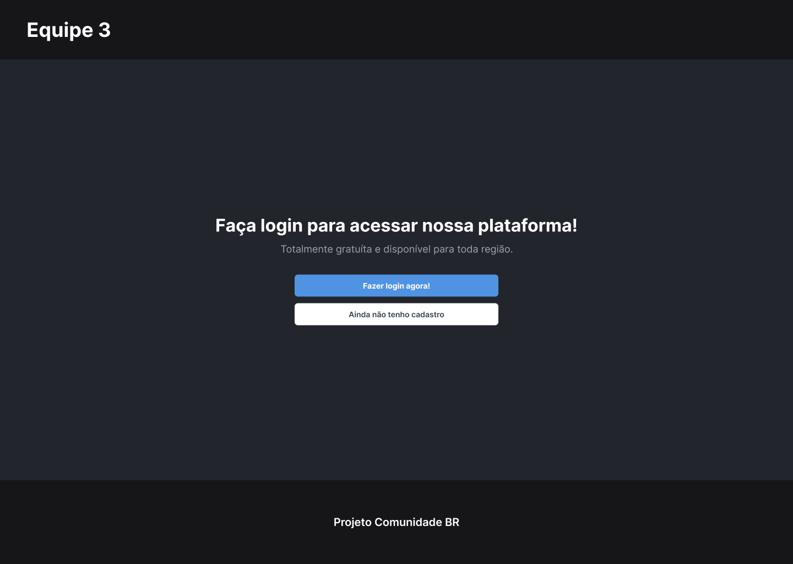

# Sistema de Login em ReactJS e NodeJS com autenticação JWT e banco de dados MongoDB.


Sistema de Login e Registro de usuário com Frontend e Backend utilizando as tecnologias mais modernas do mercado.
Projeto desenvolvido pela Equipe 3 da Comunidade BR

<p align="center">

</p>


## 🚀 Começando

Essas instruções permitirão que você obtenha uma cópia do projeto em operação na sua máquina local para fins de desenvolvimento e teste.
```
git clone https://github.com/salviotonon/Sistema_de_Login_Front.git
```


### 📋 Pré-requisitos

* [NodeJS 18.12.1 or > ](https://nodejs.org/en/) - Utilizado para executar o código no Backend e comunicação com o banco de dados
* [NPM](https://www.npmjs.com/) - Gerenciador de pacotes ou [YARN](https://yarnpkg.com/)
* [MongoDB 1.6.0](https://www.mongodb.com/try/download/shell) - Software de controle de banco de dados

### 🔧 Instalação

Com o repositório já no ambiente local digitar o comando para inicializar o programa:

```
npm install
```
ou:
```
yarn install
```
Após realizado a instalação das dependências, criar um arquivo .env no Backend seguindo o modelo de exemplo
```
ORIGIN_HOST=
DATABASE_HOST=
SECRET=
PORT=
```

## 🛠️ Construído com

Mencione as ferramentas que você usou para criar seu projeto

* [React](https://reactjs.org/) - O framework de JavaScript web usado
* [Styled-Component](https://styled-components.com/) - Poderosa junção de CSS e JavaScript utilizado para a estilização dos componentes
* [Express](https://expressjs.com/) - O framework de aplicativo da web NodeJS
* [MongoDB](https://www.mongodb.com/) -Software de banco de dados
* [JWT](https://jwt.io/) -  Padrão da Internet para a criação de dados com assinatura opcional e/ou criptografia
* [Figma](https://www.figma.com/) - Software do design

## 📌 Versão

* [Versão do projeto 1.0.0](https://github.com/salviotonon/Sistema_de_Login_Front)
* [Design da Versão 1.0.0](https://www.figma.com/file/lQApkZLu47WYvLbXcbQgRE/Projeto-Equipe-3?node-id=121%3A2263)

## ✒️ Autores

* **Desenvolvedor Frontend Salvio Tonon** (https://github.com/salviotonon)
* **Desenvolvedor Fullstack Felipe Oliveira** (https://github.com/Felipstein)
* **Desenvolvedor Fullstack Alex** (https://github.com/alexrla)

## 📄 Licença

Este projeto está sob a licença MIT -
Ela elimina qualquer tipo de restrição ao uso, modificação e distribuição do código fonte de um programa. No entanto, ela também dá a liberdade para que o developer possa utilizar o código em um projeto proprietário.

## 🎁 Fique à vontade para compartilhar o projeto!

* Conte a outras pessoas sobre este projeto 📢;
* Convide alguém da equipe para uma cerveja 🍺;

